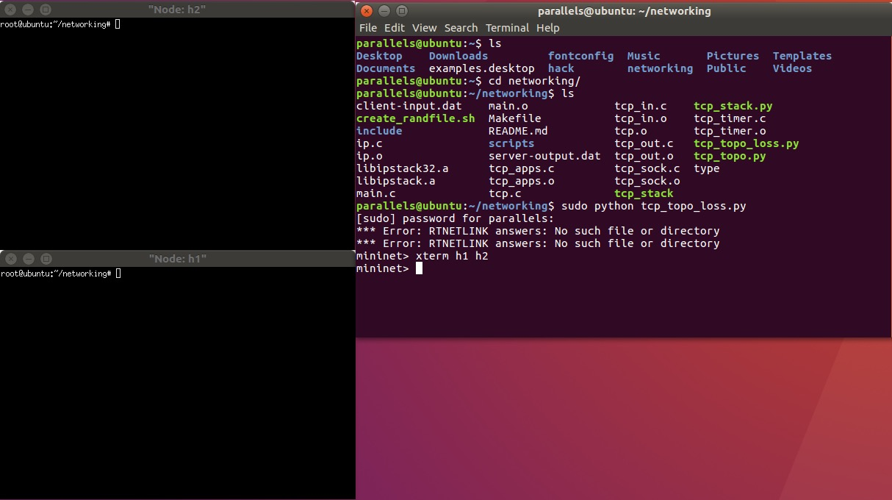
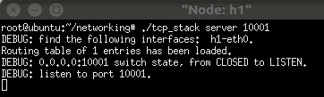
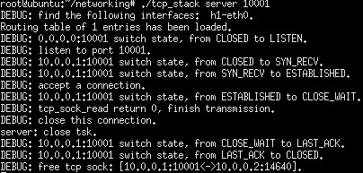
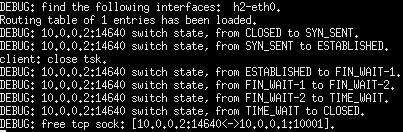
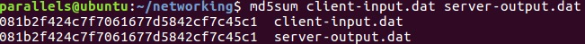

# 项目说明
Mininet 网络环境下对 TCP 主要功能的实现，包括：链接建立（三次握手）、链接释放（四次挥手）、可靠传输（超时重传、快速重传）、流量控制（包含窗口探测）、拥塞控制（慢启动、拥塞避免、快速恢复等）

在装好 Mininet 后通过 `make` 编译该项目，通过 `sudo python tcp_topo_loss.py` 可以在 Mininet 中搭建一个5%丢包率的拓扑网络结构，通过 `xterm h1 h2` 可以分别打开两个待通信节点的终端

将 h1（10.0.0.1）作为服务端，h2（10.0.0.2）作为客户端，h1 通过 `./tcp_stack server 10001` 对 10001 端口进行监听，

h2 通过 `./tcp_stack client 10.0.0.1 10001` 请求与 h1 的 10001 端口建立 TCP 链接

h2 将随机生成的文件 `client-input.dat` 通过 TCP 双方完成了链接建立（三次握手）、数据传输（可靠传输、流量控制、拥塞避免）、链接释放（四次挥手）等过程传送到 h1，名为 `server-output.dat`

下图为 h1 的过程：

下图为 h2 的过程：

通过 `md5sum` 命令检验文件是否无差错的传送了

